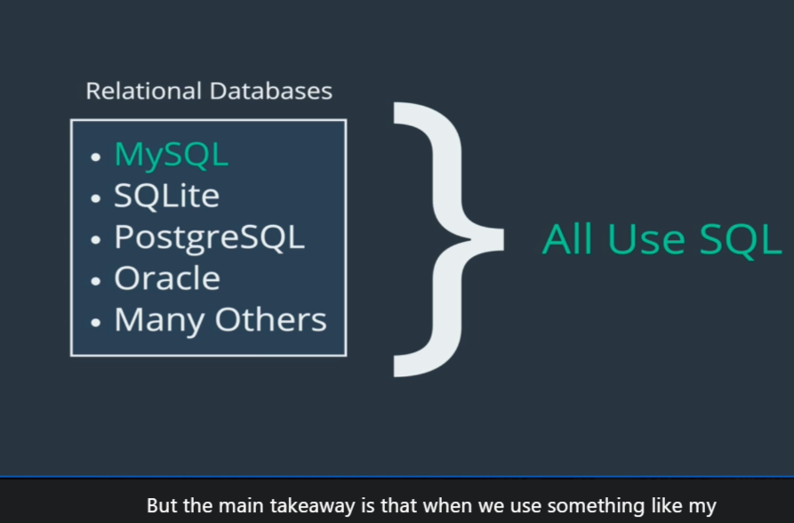
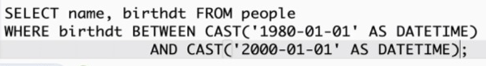
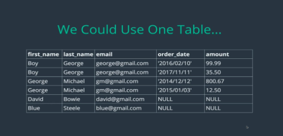
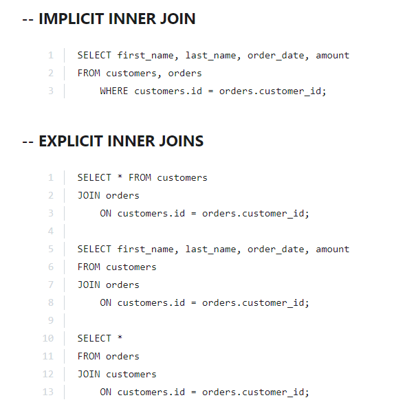
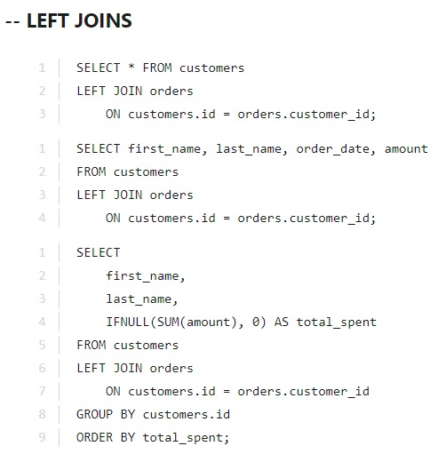

# SQL note

NhanNguyen

some little note by myself to remind what did i learn

---

## Things worth to review:

| No. | Content                                   |
| --- | ----------------------------------------- |
|     |                                           |
| 1   | [Basic](#basic) |
| 2   | [Datatype](#sql-```Database```-basic) |
| 3   | [String Function](#string-function) |
| 4   | [Selection](#selection) |
| 5   | [Where clause and Logical operator](#logical-perator) |
| 6   | [Relationship and join](#Relationship-and-join) |
| 7   | [Stored Procedure](#stored-procedure) |

# SQL, ```Database``` - Basic

SQL is a language we use to talk to our ```Database```

SQL Server is a ```Database``` server, this store all of our data, table, stored procedure

MySQL, SSMS is a ```Database``` Management System - underthe hood we use SQL language to interact with ```Database```

```What is Database?```

```Database``` is a collection of data and ```Database``` is a method to accessing and manipulating our data

=> When talk about ```Database``` we talk about DBMS and ```Database```

=> ```Database``` is just a bunch of tables

```
CREATE Database <name>;
show Databases;
DROP Database <name>;
SELECT databse();
```



## SQL CONVENTION

* Uppercase in SQL is not a must
=> It just because people want to separate sql syntax and variable

* Table name must be in plural

* ```Stored procedure``` should be start with sp not _sp because people want to seperate system procedure with our procedure

* String in SQL is case insensitive

* Make sure you select right after delete or update

# Datatype

Column (header) in table must be consisten type (SQL force you to do it) because only if these have the same type - you can use sql language to query them 

1. Storing text

    * Char: fixed length - if it longer -> automatically reduce (it will auto fill if it not enough charactor

    * Varchar: not fill automatically

2. Decimal number

    * Decimal: Decimal(n,d) -> very precis

    * Float, Double: store gain number -> not percise

    * => Better using Decimal

3. Others

    * Date - CURDATE(): only date YYYY-MM-DD

    * Time - CURTIME(): only ti#me HH:MM:SS

    * DateTime - NOW(): YYYY-MM-DD HH:MM:SS

4. Formatting Date

    * DAY(DateTime) - get day

    * DAYNAME(DateTime) - get day name (mon, tues…)

    * DAYOFWEEK(DateTime)  - get number of day in week

    * DAYOFYEAR(DateTime) - get number of day in year

5. Date Math

    * DATEDIFF(NOW(), date)

6. TiMESTAMP

    * TimeStamp is a term refer to the time user insert some thing or the time of the row be created

    * It take up less space than DateTime

# String function

* CONCAT
* SUBSTRING
* REPLACE
* REVERSE
* CHARLENGTH
* UPPER 
* LOWER


# Selection

* Select all: *
* DISTINCT + STRING FUNCTION
* ORDER BY - ORDER BY <number> - ORDER BY DESC - ORDER BY author_lname, author_fname - ORDER BY + TOP 
* LIMIT - LIMIT + ORDER BY 
* TOP - TOP + ORDER BY
    - SELECT * FROM books ORDER BY stock_quantity DESC OFFSET 0 ROWS FETCH NEXT 10 ROWS ONLY;
* LIKE - better searching data

# Logical Operator

WHERE + LOGICAL OPERATOR

* ````Equal: ````=
* ````Not Equal:```` !=
* ````Greater than:```` >
* ````Smaller than:```` <
* ````Between: ```` <column> BETWEEN … IN
* ````Not between:```` <column> NOT BETWEEN … IN
* ````IN: ````<column> IN (value1, value2,… valueN)
* ````NOT IN:```` <column> NOT IN (value1, value2,… valueN)
* ````CASE - ````WHEN - THEN - ELSE - END : Case staments
* ````IFNULL: ````IFNULL(<checkedValue>, relacedValue)

=> When use logical operator with datetime => It is best CAST(value AS DATETIME)  to convert to the same type

=> Cast('2021-10-28' as DATETIME)




# Relationship and join

## Basic

* One to one

* One to many

* Many to many

Why we need a relationship between two table?

=> It make easier to work with single table for single purpose

=> It reduce null value in many column



=> Best idea to seperate to many table and make relationship between them

## PRIMARY KEY & FOREIGN KEY

1. Primary key: is the unique ID of one table, it guarantee this record /this row to be unique
	
    * The MS SQL Server uses the IDENTITY keyword to perform an auto-increment feature.
		
    * In the example above, the starting value for IDENTITY is 1, and it will increment by 1 for each new record.

    * Tip: To specify that the "Personid" column should start at value 10 and increment by 5, change it to IDENTITY(10,5).
		
    * From <https://stackoverflow.com/questions/10991894/auto-increment-primary-key-in-sql-server-management-studio-2012> 
		
2. Foreign key: is the key reference to other table. Foreign key not require to be unique
	
## ```Database``` schema

The ```Database``` schema is its structure described in a formal language supported by the ```Database``` management system (DBMS). The term "schema" refers to the organization of data as a blueprint of how the ```Database``` is constructed (divided into ```Database``` tables in the case of relational ```Database```s). 

- From <https://en.wikipedia.org/wiki/```Database```_schema> 

A ```Database``` schema is an abstract design that represents the storage of your data in a ```Database```. It describes both the organization of data and the relationships between tables in a given ```Database```. Developers plan a ```Database``` schema in advance so they know what components are necessary and how they will connect to each other.

- From <https://www.educative.io/blog/what-are-```Database```-schemas-examples> 

## ONE TO MANY

Config: 

		CREATE TABLE customers (
			id INT IDENTITY(1,1) PRIMARY KEY,
			first_name VARCHAR(100),
			last_name VARCHAR(100),
			email VARCHAR(100),
		)
		
		CREATE TABLE orders (
			id INT IDENTITY(1,1) PRIMARY KEY,
			order_date DATE,
			amount DECIMAL(8,2),
			customer_id INT,
			FOREIGN KEY (customer_id) REFERENCES customers(id)
		)


## INNER JOIN


=> Join two table and take record from that table where condition is met

> https://dataschool.com/how-to-teach-people-sql/inner-join-animated/



## LEFT JOIN 

=> Take right table and join with the left table where the condition is met

> https://dataschool.com/how-to-teach-people-sql/left-right-join-animated/



# Stored Procedure

- This is a way to store/wrap a query code, help you avoid to write the same query again and again.
	
- This ```stored procedure``` is already compiled and it will run the query logic inside ```stored procedure``` when we excecute this ```stored procedure```.

- ```Stored Procedure``` is stored in our ```Database``` and it already excecuted

- Benefit:
    - Security
    - Network traffic

> on nocount 

=> Mean we specify we dont want to count how many row is effected

