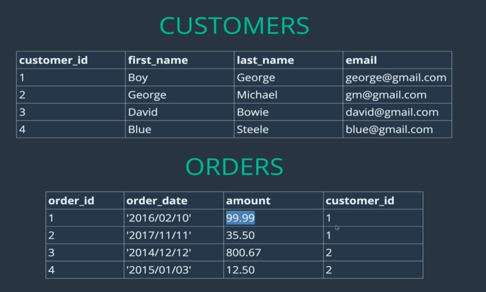

# SQL note

NhanNguyen

some little note by myself to remind what did i learn

---

## Things worth to review:

| No. | Content                                   |
| --- | ----------------------------------------- |
|     |                                           |
| 1   | [Basic](#basic) |
| 2   | [Datatype](#```SQL```-```Database```-basic) |
| 3   | [String Function](#string-function) |
| 4   | [Selection](#selection) |
| 5   | [Where clause and Logical operator](#logical-perator) |
| 6   | [Relationship and join](#Relationship-and-join) |
| 8   | [Trigger](#trigger) |
| 9   | [Key constraint](#key-constraint) |
| 10   | [Group by](#group-by) |
| 11   | [Join](#join) |
| 12   | [Replace Null](#replace-null) |
| 13   | [Stored Procedure](#stored-procedure) |

# SQL, Database - Basic

```SQL``` is a language we use to talk to our ```Database```

```SQL``` Server is a ```Database``` server, this store all of our data, ```Table```, stored procedure

My```SQL```, SSMS is a ```Database``` Management System - underthe hood we use ```SQL``` language to interact with ```Database```

```What is Database?```

```Database``` is a collection of data and ```Database``` is a method to accessing and manipulating our data

=> When talk about ```Database``` we talk about DBMS and ```Database```

=> ```Database``` is just a bunch of ```Table```s

```
CREATE Database <name>;
show Databases;
DROP Database <name>;
SELECT databse();
```


## SQL CONVENTION

* Uppercase in ```SQL``` is not a must
=> It just because people want to separate ```SQL``` syntax and variable

* ```Table``` name must be in plural

* ```Stored procedure``` should be start with sp not _sp because people want to seperate system procedure with our user defined procedure

* String in ```SQL``` is case insensitive

* Make sure you select right after delete or update

## Namespace of a database

```
Use [name of Database]
Go
```

=> It will do the query based on this Database, and change our environment to this namespace

## Creating and Altering Database/```Table```

Creat Database/```Table``` <Database/```Table``` Name>: To Create

Alter Database/```Table``` <Database/```Table``` Name>: To Modify

Drop Database/```Table``` <Database/```Table``` Name>: To Drop

> It is important to note that we cant delete/drop databse is currently in use, because other developer is quering to this database. It will th```row``` to us an error

> If we really want to drop a database we must set Database to single user with rollback immediate -> It mean disconnect the database with other user and only accessalbe with one user only


## Table

We have to change the namespace of database where we want to create ```Table```, unless our ```Table``` will create some where not we want

### Primary key & Indentity Column

    Create Table tblPerson
    (
    PersonId int Identity(1,1) Primary Key,
    Name nvarchar(20)
    )


NOTE: If we delete all the row in table the indentity do not reset except we specify

> DBCC CHECKIDENT(tblPerson, RESEED, 0)


### Foreign key and Primary key constraint

We have to specifty this constraint to restrict foreign key in one ```Table``` is not match primary key in another ```Table``` => Establist the relationship between two ```Table```

To add a foreign key reference using a query

    Alter ```Table``` tblPerson 
    add constraint tblPerson_GenderId_FK FOREIGN KEY (GenderId) references tblGender(ID)


The general formula is here

    Alter ```Table``` ForeignKey```Table``` add constraint ForeignKey```Table```_ForiegnKeyColumn_FK 
    FOREIGN KEY (ForiegnKeyColumn) references PrimaryKey```Table``` (PrimaryKeyColumn)

### Default constraint - Default value for column

Altering an existing column to add a default constraint:

    ALTER Table { Table_NAME }
    ADD CONSTRAINT { CONSTRAINT_NAME }
    DEFAULT { DEFAULT_VALUE } FOR { EXISTING_COLUMN_NAME }


Adding a new column, with default value, to an existing ```Table```:

    ALTER Table { Table_NAME } 
    ADD { COLUMN_NAME } { DATA_TYPE } { NULL | NOT NULL } 
    CONSTRAINT { CONSTRAINT_NAME } DEFAULT { DEFAULT_VALUE }


The following command will add a default constraint, DF_tblPerson_GenderId.

    ALTER Table tblPerson
    ADD CONSTRAINT DF_tblPerson_GenderId
    DEFAULT 1 FOR GenderId


[Cascading referential integrity constraint](https://www.youtube.com/watch?v=ETepOVi7Xk8&list=PL08903FB7ACA1C2FB&index=6)

### Check Constraint

To check a columns before it was insert into our database

The following check constraint, limits the age between ZERO and 150.

    ALTER TABLE tblPerson
    ADD CONSTRAINT CK_tblPerson_Age CHECK (Age > 0 AND Age < 150)


The general formula for adding check constraint in SQL Server:

    ALTER TABLE { TABLE_NAME }
    ADD CONSTRAINT { CONSTRAINT_NAME } CHECK ( BOOLEAN_EXPRESSION )

* ```CK_```: is a convention to prefix of constraint

If the BOOLEAN_EXPRESSION returns true, then the CHECK constraint allows the value, otherwise it doesn't. Since, AGE is a nullable column, it's possible to pass null for this column, when inserting a row. When you pass NULL for the AGE column, the boolean expression evaluates to UNKNOWN, and allows the value.


To drop the CHECK constraint:

    ALTER TABLE tblPerson
    DROP CONSTRAINT CK_tblPerson_Age

# Datatype

Column (header) in ```Table``` must be consisten type (```SQL``` force you to do it) because only if these have the same type - you can use ```SQL``` language to query them 

1. Storing text

    * Char: fixed length - if it longer -> automatically reduce (it will auto fill if it not enough charactor

    * Varchar: not fill automatically

2. Decimal number

    * Decimal: Decimal(n,d) -> very precis

    * Float, Double: store gain number -> not percise

    * => Better using Decimal

3. Others

    * Date - CURDATE(): only date YYYY-MM-DD

    * Time - CURTIME(): only ti#me HH:MM:SS

    * DateTime - NOW(): YYYY-MM-DD HH:MM:SS

4. Formatting Date

    * DAY(DateTime) - get day

    * DAYNAME(DateTime) - get day name (mon, tues…)

    * DAYOFWEEK(DateTime)  - get number of day in week

    * DAYOFYEAR(DateTime) - get number of day in year

5. Date Math

    * DATEDIFF(NOW(), date)

6. TiMESTAMP

    * TimeStamp is a term refer to the time user insert some thing or the time of the ```row``` be created

    * It take up less space than DateTime

# String function

* CONCAT
* SUBSTRING
* REPLACE
* REVERSE
* CHARLENGTH
* UPPER 
* LOWER


# Selection

* Select all: *
* DISTINCT + STRING FUNCTION
* ORDER BY - ORDER BY <number> - ORDER BY DESC - ORDER BY author_lname, author_fname - ORDER BY + TOP 
* LIMIT - LIMIT + ORDER BY 
* TOP - TOP + ORDER BY
    - SELECT * FROM books ORDER BY stock_quantity DESC OFFSET 0 ```row```S FETCH NEXT 10 ```row```S ONLY;
* LIKE - better searching data

## Wild Cards

-  % : specify zero or more characters

- - : specify exacly one character

- [] : any characters with in the brackets

- [^]: not any character with in the bracket

## Select top n or top n percentage of rows

We will use ```select top(n)``` combine with ```order by clause```

    SELECT TOP 50 PERCENT * FROM tblPerson ORDER BY age DESC

## Distinct row

To Select distinct rows use DISTINCT keyword

    SELECT DISTINCT Column_List
    FROM Table_Name

##

# Logical Operator

WHERE + LOGICAL OPERATOR

* ````Equal: ````=
* ````Not Equal:```` !=
* ````Greater than:```` >
* ````Smaller than:```` <
* ````Between: ```` <column> BETWEEN … IN
* ````Not between:```` <column> NOT BETWEEN … IN
* ````IN: ````<column> IN (value1, value2,… valueN)
* ````NOT IN:```` <column> NOT IN (value1, value2,… valueN)
* ````CASE - ````WHEN - THEN - ELSE - END : Case staments
* ````IFNULL: ````IFNULL(<checkedValue>, relacedValue)

=> When use logical operator with datetime => It is best CAST(value AS DATETIME)  to convert to the same type

=> Cast('2021-10-28' as DATETIME)


# Relationship and join

## Basic

* One to one

* One to many

* Many to many

Why we need a relationship between two ```Table```?

=> It make easier to work with single ```Table``` for single purpose

=> It reduce null value in many column


=> Best idea to seperate to many ```Table``` and make relationship between them

## Primary key and Foreign Key

1. Primary key: is the unique ID of one ```Table```, it guarantee this ```record``` /this ```row``` to be unique
	
    * The MS ```SQL``` Server uses the IDENTITY keyword to perform an auto-increment feature.
		
    * In the example above, the starting value for IDENTITY is 1, and it will increment by 1 for each new ```record```.

    * Tip: To specify that the "Personid" column should start at value 10 and increment by 5, change it to IDENTITY(10,5).
		
    * From <https://stackoverflow.com/questions/10991894/auto-increment-primary-key-in-```SQL```-server-management-studio-2012> 
		
2. Foreign key: is the key reference to other ```Table```. Foreign key not require to be unique
	
## ```Database``` schema

The ```Database``` schema is its structure described in a formal language supported by the ```Database``` management system (DBMS). The term "schema" refers to the organization of data as a blueprint of how the ```Database``` is constructed (divided into ```Database``` ```Table```s in the case of relational ```Database```s). 

- From <https://en.wikipedia.org/wiki/```Database```_schema> 

A ```Database``` schema is an abstract design that represents the storage of your data in a ```Database```. It describes both the organization of data and the relationships between ```Table```s in a given ```Database```. Developers plan a ```Database``` schema in advance so they know what components are necessary and how they will connect to each other.

- From <https://www.educative.io/blog/what-are-```Database```-schemas-examples> 

## One to many

Config: 

		CREATE ```Table``` customers (
			id INT IDENTITY(1,1) PRIMARY KEY,
			first_name VARCHAR(100),
			last_name VARCHAR(100),
			email VARCHAR(100),
		)
		
		CREATE ```Table``` orders (
			id INT IDENTITY(1,1) PRIMARY KEY,
			order_date DATE,
			amount DECIMAL(8,2),
			customer_id INT,
			FOREIGN KEY (customer_id) REFERENCES customers(id)
		)



## Inner Join


=> Join two ```Table``` and take ```record``` from that ```Table``` where condition is met

> https://dataschool.com/how-to-teach-people-```SQL```/inner-join-animated/


## Left Join 

=> Take right ```Table``` and join with the left ```Table``` where the condition is met

> https://dataschool.com/how-to-teach-people-```SQL```/left-right-join-animated/


---

---


# Trigger

Trigger is an action that will be triggered when specify action is used


# Key constraint

## Primary key constraint

This is a way to make sure primary key in the table is unique

## Unique key constraint

This is another way to make sure other columns do not have duplicate value

Both primary key and unique key are used to enforce, the uniqueness of a column. So, when do you choose one over the other?

    A table can have, only one primary key. If you want to enforce uniqueness on 2 or more columns, then we use unique key constraint.

What is the difference between Primary key constraint and Unique key constraint? This question is asked very frequently in interviews.

1. A table can have only one primary key, but more than one unique key

2. Primary key does not allow nulls, where as unique key allows one null

To create the unique key using a query:

    Alter Table Table_Name
    Add Constraint Constraint_Name Unique(Column_Name)

To drop the constraint

    1. Right click the constraint and delete.
    Or
    2. Using a query
    Alter Table tblPerson
    Drop COnstraint UQ_tblPerson_Email

# Group by

```Group by``` clause is used to group a selected set of rows into a set of summary rows by the values of one or more columns or expressions. It is always used in conjunction with one or more ```aggregate functions```.

## Filtering Groups

WHERE clause is used to filter rows before aggregation, where as HAVING clause is used to filter groups after aggregations. The following 2 queries produce the same result.

Filtering rows using WHERE clause, before aggrgations take place:

    Select City, SUM(Salary) as TotalSalary
    from tblEmployee
    Where City = 'London'
    group by City

Filtering groups using HAVING clause, after all aggrgations take place:

    Select City, SUM(Salary) as TotalSalary
    from tblEmployee
    group by City
    Having City = 'London'

Difference between WHERE and HAVING clause:

    1. WHERE clause can be used with - Select, Insert, and Update statements, where as HAVING clause can only be used with the Select statement.
    2. WHERE filters rows before aggregation (GROUPING), where as, HAVING filters groups, after the aggregations are performed.
    3. Aggregate functions cannot be used in the WHERE clause, unless it is in a sub query contained in a HAVING clause, whereas, aggregate functions can be used in Having clause.

# Join

General Formula for Joins

    SELECT      ColumnList
    FROM           LeftTableName
    JOIN_TYPE  RightTableName
    ON                 JoinCondition

    SELECT Name, Gender, Salary, DepartmentName
    FROM tblEmployee
    INNER JOIN tblDepartment
    ON tblEmployee.DepartmentId = tblDepartment.Id


## Advanced join


# Replace null

Replacing NULL value using ISNULL() function: We are passing 2 parameters to IsNULL() function. If M.Name returns NULL, then 'No Manager' string is used as the replacement value.

    SELECT E.Name as Employee, ISNULL(M.Name,'No Manager') as Manager
    FROM tblEmployee E
    LEFT JOIN tblEmployee M
    ON E.ManagerID = M.EmployeeID

Replacing NULL value using CASE Statement:

    SELECT E.Name as Employee, CASE WHEN M.Name IS NULL THEN 'No Manager' 
    ELSE M.Name END as Manager
    FROM  tblEmployee E
    LEFT JOIN tblEmployee M
    ON   E.ManagerID = M.EmployeeID

Replacing NULL value using COALESCE() function: 
COALESCE() function, returns the first NON NULL value.

    SELECT E.Name as Employee, COALESCE(M.Name, 'No Manager') as Manager
    FROM tblEmployee E
    LEFT JOIN tblEmployee M
    ON E.ManagerID = M.EmployeeID


# Stored Procedure

A stored procedure is group of T-SQL (Transact SQL) statements. If you have a situation, where you write the same query over and over again, you can save that specific query as a stored procedure and call it just by it's name.

=> It help to avoid writing query over and over again
	
- This ```stored procedure``` is already compiled and it will run the query logic inside ```stored procedure``` when we excecute this ```stored procedure```.

- ```Stored Procedure``` is stored in our ```Database``` and it already excecuted

- Benefit:
    - Security
    - Network traffic

> on nocount 

=> Mean we specify we dont want to count how many ```row``` is effected

Creating a simple stored procedure without any parameters: This stored procedure, retrieves Name and Gender of all the employees. To create a stored procedure we use, CREATE PROCEDURE or CREATE PROC statement.

    Create Procedure spGetEmployees
    as
    Begin
    Select Name, Gender from tblEmployee
    End


To execute the stored procedure, you can just type the procedure name and press F5, or use EXEC or EXECUTE keywords followed by the procedure name as shown below.

    1. spGetEmployees
    2. EXEC spGetEmployees
    3. Execute spGetEmployees

Note: You can also right click on the procedure name, in object explorer in SQL Server Management Studio and select EXECUTE STORED PROCEDURE.

Creating a stored procedure with input parameters: This SP, accepts GENDER and DEPARTMENTID parameters. Parameters and variables have an @ prefix in their name.

    Create Procedure spGetEmployeesByGenderAndDepartment 
    @Gender nvarchar(50),
    @DepartmentId int
    as
    Begin
        Select Name, Gender from tblEmployee Where Gender = @Gender and DepartmentId = @DepartmentId
    End

To invoke this procedure, we need to pass the value for @Gender and @DepartmentId parameters. If you don't specify the name of the parameters, you have to first pass value for @Gender parameter and then for @DepartmentId.
EXECUTE spGetEmployeesByGenderAndDepartment 'Male', 1

On the other hand, if you change the order, you will get an error stating "Error converting data type varchar to int." This is because, the value of "Male" is passed into @DepartmentId parameter. Since @DepartmentId is an integer, we get the type conversion error.
spGetEmployeesByGenderAndDepartment 1, 'Male'

When you specify the names of the parameters when executing the stored procedure the order doesn't matter.

    EXECUTE spGetEmployeesByGenderAndDepartment @DepartmentId=1, @Gender = 'Male'

To change the stored procedure, use ALTER PROCEDURE statement:

    Alter Procedure spGetEmployeesByGenderAndDepartment 
    @Gender nvarchar(50),
    @DepartmentId int
    as
    Begin
        Select Name, Gender from tblEmployee Where Gender = @Gender and DepartmentId = @DepartmentId order by Name
    End

## Stored procedure with output parameter


## Advance of stored procedure

The following advantages of using Stored Procedures over adhoc queries (inline SQL)

1. Execution plan retention and reusability - Stored Procedures are compiled and their execution plan is cached and used again, when the same SP is executed again. Although adhoc queries also create and reuse plan, the plan is reused only when the query is textual match and the datatypes are matching with the previous call. Any change in the datatype or you have an extra space in the query then, a new plan is created.

2. Reduces network traffic - You only need to send, EXECUTE SP_Name statement, over the network, instead of the entire batch of adhoc SQL code.

3. Code reusability and better maintainability - A stored procedure can be reused with multiple applications. If the logic has to change, we only have one place to change, where as if it is inline sql, and if you have to use it in multiple applications, we end up with multiple copies of this inline sql. If the logic has to change, we have to change at all the places, which makes it harder maintaining inline sql.

4. Better Security - A database user can be granted access to an SP and prevent them from executing direct "select" statements against a table.  This is fine grain access control which will help control what data a user has access to.

5. Avoids SQL Injection attack - SP's prevent sql injection attack. Please watch this video on SQL Injection Attack, for more information.